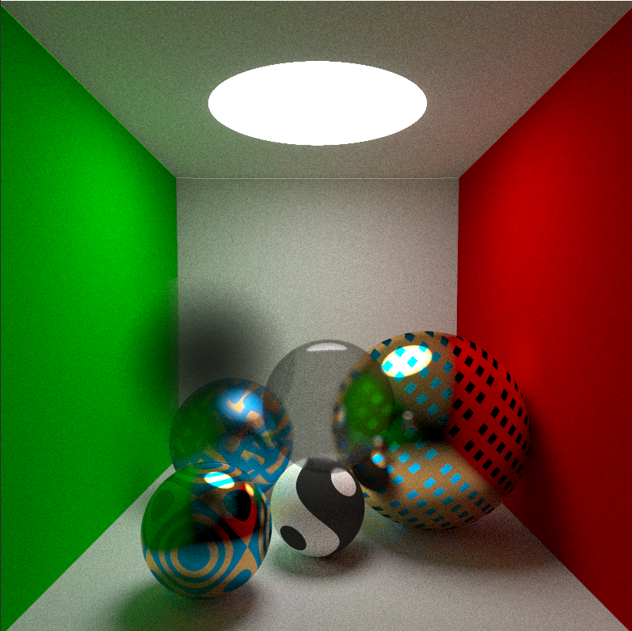

# 太极图形课S1-光线追踪：带有图案的球
[Taichi] version 0.8.5, llvm 10.0.0, commit 45c6ad48, win, python 3.9.1

## 背景简介
基于课程案例 4_0_path_tracing.py 修改得到。

在学习了光追算法后，希望增加更多表面细节。为了方便，目前增加了三种规则的纹理效果，包括：
1. 方形网格状的亮片材质纹理
1. 长条网格状的哑光材质纹理
2. 西瓜条纹状的纹理

图案均是直接算法生成，避免了贴图的麻烦，也很容易举一反三。

理论上，感觉之前作业里的各种图案通过球面映射都能搞上去，但我的电脑目前这样已经严重掉帧了，欢迎大家尝试！

## 成功效果展示
展示图片

